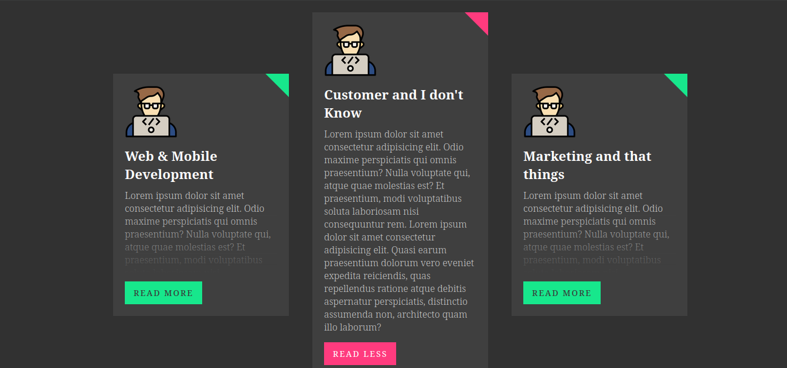
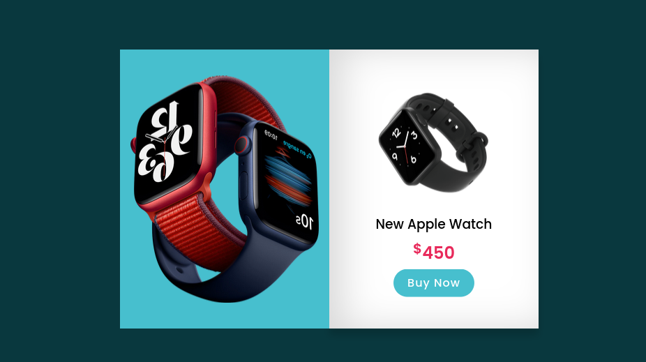
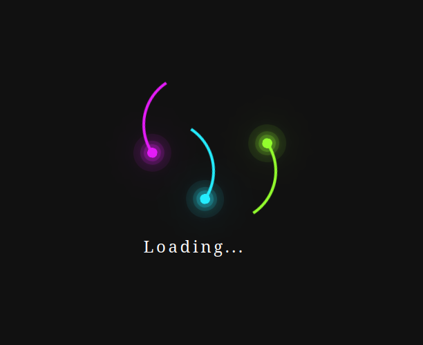
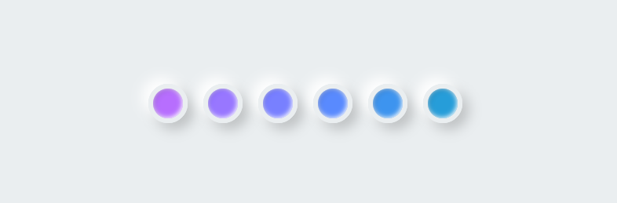
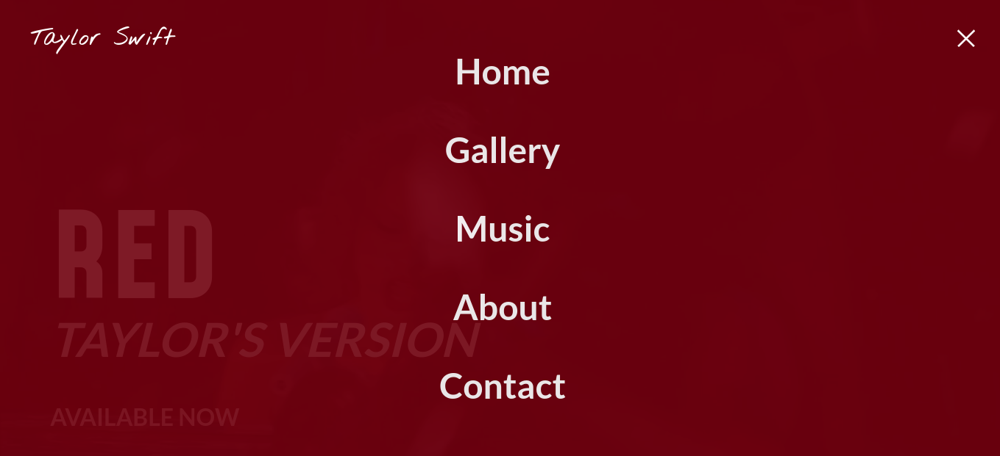

# Plantillas de HTML y CSS

En esta carpeta encontrarás materiales para crear plantillas impresionantes utilizando HTML, CSS y React. Con diseños que hice y me parecieron muy interesantes y reutilizables en cualquier proyecto | HTML, CSS, React

## Podrás utilizar las siguientes plantillas:

  

    <h3>404</h3>
    
  

  

    <h3>Card Read More</h3>
    
  

  

    <h3>Ying Yang</h3>
    
  

  

    <h3>Dropdown Menu</h3>
    
  

  

    <h3>Flip Product</h3>
    
  

  

    <h3>Loading</h3>
    
  

  

    <h3>NavEffects</h3>
    
  

  

    <h3>Neumorphism Loading</h3>
    
  

  

    <h3>Video Background</h3>
    
  

